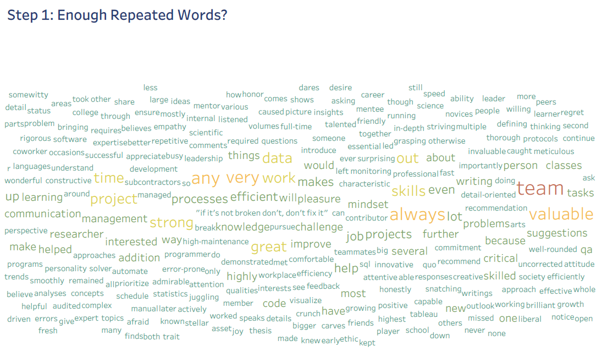
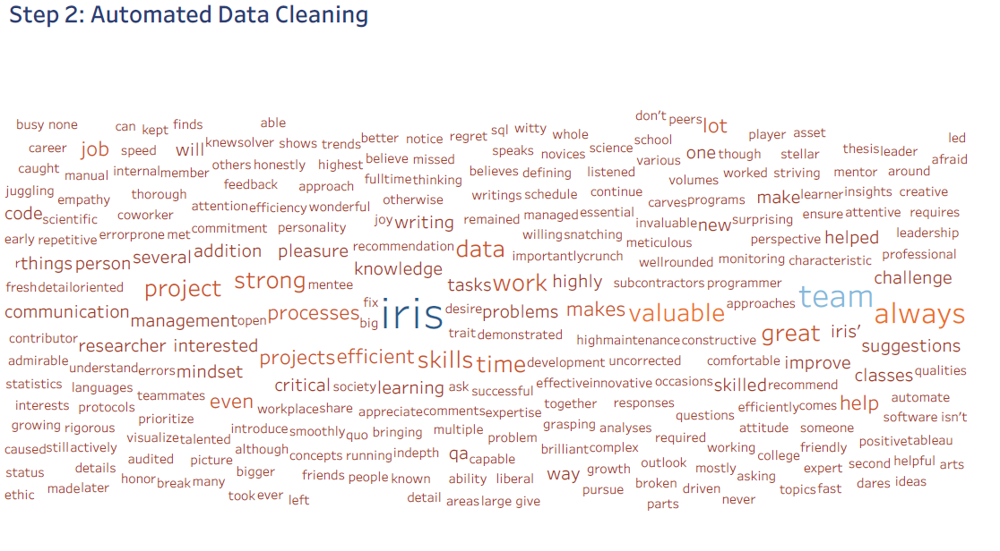

```{r setup, include=FALSE}
knitr::opts_chunk$set(echo = TRUE,
                  fig.path='graphics-', 
                 cache.path='cache/graphics-', 
                 fig.align='center',
                 external=TRUE,
                 echo=TRUE,
                 warning=FALSE,
                 fig.pos='H'
                )
```

## Thank You

Thank you to Dr. Brooke Wilken who patiently listens to my endless rambles while providing me direction on where I should take my analyses!

Thank you to Dr. H Elton Hunte! After a phone conversation with him, he provided the valuable advice that project ideas can come from anywhere, including my resume, and it was important that I showed people I could use tools, not just claim I could. That idea festered in my brain, and ultimately, this project was the result of that phone call.

Thank you to everyone who has provided me a recommendation on LinkedIn!


## Preliminary Testing

At the end of December 2020, I realized I had 7 recommendations on my LinkedIn, but wanted to see if there were any common themes that were repeated throughout. If there were, a visually fun way to show the repeated words would be to create a wordcloud.

I copied and pasted the recommendations into Microsoft Excel so that I could import them into Tableau. 

In Excel, I 


1.  Used the "text to column" function and split up the paragraph(s) so that each word is in its own cell
2.  Manually replaced punctuation (e.g., periods, commas, quotes)
3.  Used the lower() function in order to ensure that every word is treated the same whether it was originally capitalized or not
4.  Transposed the words so that every word was in the same column even if they were duplicated
5.  Saved the Excel file

In Tableau, I created a data connection to that Excel sheet with the transposed words. In a new worksheet, I was able to 


1.  Drag the Words variable over to the "Text" 
2.  Drag the count (automatically created field) to the size and the color
3.  Fiddled with the colors so that even the words which were only mentioned once were a dark enough color
4.  Drag the Words variable over to the filter box
  This allowed me to manually exclude some stop words that were taking up most of the space. I also wanted to exclude my name so that I could more clearly see the size difference with other, more meaningful, words.

I ended up with a wordcloud where some words stood out so I decided to try this out in R where there was more automation and if I wanted to do it again, I would only have to re-run the script.

```{r Initial_wordcloud, echo=FALSE, fig.cap="Initial Wordcloud", out.width = '100%'}

```

## Automation in R

After I showed this to Dr, Brooke Wilken, her first reaction was to tell me to search up NLP techniques to systematically remove stop words. This made me excited because that was naturally the next step I was going to take and I decided to do it in R. I did my standard set up for my R scripts which includes setting the working directory and using a function to load all the packages I would need at once.

```{r working_directory, echo=TRUE, results=FALSE}
getwd()
```
I added the packages I referenced into the "packages" vector as I wrote the script. I didn't know the exact packages I would need until after I finished everything. There was a bit of trouble at the start when I was loading tidyverse because I couldn't install the package despite knowing it existed. After two days of searching for solutions on the Internet, I realized I needed to update my R and RStudio. Afterewards, the lapply function returned TRUE for all packages.

```{r packages, echo=TRUE}
packages <- c("readxl","dplyr","tm", "tidytext", "tau","tidyr", "RColorBrewer"
              , "wordcloud","wordcloud2","tidyverse", "writexl","reshape2")

usePackage <- function(p) {
  if (!is.element(p, installed.packages()[,1]))
    install.packages(p, dep = TRUE)
  require(p, character.only = TRUE)
}

lapply(packages, usePackage)
```

I read the data into R. I used the same initial Excel spreadsheet in the preliminary testing before I transformed the data for Tableau.

```{r data}
rawdata <- read_excel("Recs.xlsx")
```

I removed stop words, punctuation, and white space. I placed all of this into a corpus, which is a list with extra content. The tm (text mining) package has a list of common English stop words, and I changed everything to lowercase again, this time in R.

In my quest to remove stop words, I discovered two ways to remove them, before they were in the corpus, and afterwards. I kept both methods in here because it didn't affect the end outcome. There is a warning message that the transformation drops documents, but again, this didn't impact the end outcome.

```{r removal}
stop <- tm::stopwords("english")

removed <- remove_stopwords(as.character(rawdata[,1]),stop, lines=TRUE)

docs <- Corpus(VectorSource(removed))

docs <- docs %>%
  tm_map(removeNumbers) %>%
  tm_map(removePunctuation) %>%
  tm_map(stripWhitespace)

docs <- tm_map(docs, content_transformer(tolower))
docs <- tm_map(docs, removeWords, stopwords("english"))
```

From here, I had two options to create my wordcloud: R and Tableau.

### Option 1: R

When I was trying to figure out the specifics of how R handles corpus, I chanced upon the documentation for it which conveniently included examples of code to use the corpus to turn it into a word cloud.

  https://www.rdocumentation.org/packages/tm/versions/0.7-8/topics/Corpus

I had to create a bag of word model. A bag of word model deconstructs the sentences and views each word as an individual word without the context. This is similar to placing each word in its own cell like what I did in Excel above. 

```{r BagOfWords}
dtm <- DocumentTermMatrix(docs)
dtm <- removeSparseTerms(dtm, 0.999)
dataset <- as.data.frame(as.matrix(dtm))
dataset <- as.matrix(dtm)

```

After creating the matrix, I had to count the number of times the unique words appear in each of the recommendations. I combined the unique words and the number of times they appear as part of the wordcloud function. The wordcloud doesn't place the items in the same location or orientation when it is rendered, so there is some variability.

```{r Wordcloud, out.width = "8.5in"}
v <- sort(colSums(dataset),decreasing=TRUE)
myNames <- names(v)
d <-  data.frame(word=myNames,freq=v)

wordcloud(d$word,scale=c(4,.3)
          , colors=c(6,4,3,2,1,10,11,12)
          , random.color=FALSE
          , d$freq, min.freq=80)
```

### Option 2: Tableau

I changed the corpus to a data frame, and used the strsplit function to create a separate column for every word in every entry. I applied the melt function to every value inside the data frame (essentially creating a single column of every word for each of the recommendations I received). Using the unlist and as.data.frame functions, I created a data frame that has one column, with all the words from each of the seven recommendations. I could then export this into an Excel spreadsheet. I chose to name the file "BagOfWords" because that's what it would function as.

```{r Tableau}
df <- data.frame(text=sapply(docs, identity), 
                        stringsAsFactors=F)

individual <- strsplit(df$text, " ")
column <- lapply(individual,melt)
Tableau <- as.data.frame(unlist(column))
colnames(Tableau) <- c("Words")

write_xlsx(Tableau,"BagOfWords.xlsx")
```

I repeated the same steps as I did in Step 1, with a shortcut. I used the same Tableau workbook as Step 1 and I created a new data connection for BagOfWords. There isn't any need to join the variable with the one used in Step 1, hence the need for a new connection. I duplicated the worksheet in Step 1 but replaced the variable using the one from BagOfWords. There were a couple of key differences:

1.  I didn't want to use any red or green just in case the viewer happened to be red-green colorblind (unfortunately, selecting orange instead of yellow still comes out as slightly red, but I needed it to be darker so that the words were more legible)
2.  I manually removed a few entries in the Words variable (e.g., "'s", "also") since they didn't make sense to keep
3.  I kept my name because this was an analysis about me and the other words were clearly of different sizes

I created a story book in the dashboard to outline the Tableau-specific steps, hence the title within Tableau lists this as Step 2.

```{r Tableau_wordcloud, echo=FALSE, fig.cap="Tableau Wordcloud", out.width = '100%'}

```


## Future Steps

I didn't do a sentiment analysis because it wouldn't make sense. Recommendations are supposed to be positive for the individual, but there are other ways I could take this analysis further. Some of the items which I would like to to explore further when I have the time include:

*  When I removed punctuation, apostrophes weren't removed.
*  I searched around to see if I could download the recommendations via an API so I could remove the manual effort of copying and pasting them into Excel. Since this isn't the true benefit of LinkedIn (which I'd argue is networking and connections), it doesn't seem like anyone has explored this yet
* Dr. H Elton Hunte advised me to choose different colors to make the more repeated words stand out. I wanted to avoid using red and green due to red-green colorblindness, so I will need to play around with colors more to see if I could get a sufficiently dark color while still making words which appear more frequently stand out.
* Once I have more recommendations, I would like to try and use other Tableau graphs (e.g., bar charts) to depict which words are used more often.


* add a shape to the word cloud
* cluster analysis
Brooke's suggestions
*put the finished project up front and then go through how you got there
*don't use a bag of words model. using adjectives only would've been best
*I also would ask, "What did you learn?" Not just about the project, but from the result. "So, who am I? What are my strengths?"
*Discussing the themes, the results
*Visually, I think word clouds are usually more like the way R made it naturally before you changed the format too. I think that's due to how people like to see them. I would recommend going with something like that
*Including a table with frequencies would be helpful, top 5 or 10 or something?
*solicited the top 10 words to describe me from family and friends and created a word cloud. If you're lacking data, you can always solicit it
*Your whole goal is to start with a problem. You're solving a business problem or need. They need to see that you can identify that. "How can I design a way for people to be able to figure out their top skills?" "I can't figure out what my top skills are...."
*"Well, the way they document things is in need of XXXX." How can you solve that? Can you develop a tool that would make documentation easier? Clearer? Quicker?
*But companies want to know, "How are you going to help us? That's great you have skills, but can you figure out how to use them for us in ways that will help us, ways that we may not even be able to see or understand?"